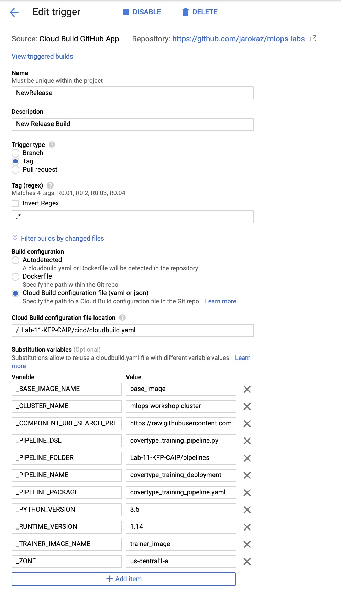

# Orchestrating model training and deployment with KFP and Cloud AI Platform

Developing a repeatable and reliable ML pipeline is a complex, multi-step process.

In most cases, you start by exploring the datasets and experimenting with data preprocessing and modeling routines in an interactive environment like Jupyter notebooks. When you zero in on a given approach you formalize your workflow by authoring an ML pipeline.

Today, the process of transitioning from an interactive notebook to an operationalized pipeline is not fully automated. You need to manually re-factor your code snippets in the notebook to ML Pipeline DSL. There is ongoing work in TFX and KFP initiatives to make the process more streamlined and eventually fully automated.

In this lab, you simulate this process by walking through the development of a KFP pipeline that orchrestrates BigQuery and Cloud AI Platform services to train and deploy a **scikit-learn model**:

1. In Part 1 of the lab, you will work in a Jupyter notebook to explore the data, prepare data extraction routines, and experiment with training and hyperparameter tuning code.

1. In Part 2, you will re-factor code snippets developed in the notebook into KFP components and a KFP pipeline.

1. In Part 3, you will author a **Cloud Build** CI/CD workflow that automatically builds and deploys the KFP pipeline.

1. In Part 4, you will integrate your CI/CD workflow with **GitHub** by setting up a trigger that starts the CI/CD workflow when a new tag is applied to your **GitHub** repo.

1. In Part 5, you will integrate the KFP pipeline with the upstream data management pipeline implemented in **Cloud Composer**.


## Lab scenario

Using the [Covertype Data Set](../datasets/covertype/README.md) you will develop a multi-class classification model that predicts the type of forest cover from cartographic data. 

The source data is in BigQuery. The pipeline uses:
- BigQuery to prepare training, evaluation, and testing data splits, 
- AI Platform Training to run a custom container with data preprocessing and training code, and
- AI Platform Prediction as a deployment target. The below diagram represents the workflow orchestrated by the pipeline.

.

## Lab setup

### AI Platform Notebook configuration
You will use the **AI Platform Notebooks** instance configured with a custom container image. To prepare the **AI Platform Notebooks** instance:

1. In **Cloud Shell**, navigate to the `Lab-00-Environment-Setup/notebook-images/kfp138` folder.
2. Build the container image
```
./build.sh
```
3. Provision the **AI Platform Notebook** instance based on a custom container image, following the  [instructions in AI Platform Notebooks Documentation](https://cloud.google.com/ai-platform/notebooks/docs/custom-container). In the **Docker container image** field, enter the following image name: `gcr.io/[YOUR_PROJECT_NAME]/kfp-dev:KFP138`.

### Lab dataset
This lab uses the [Covertype Dat Set](../datasets/covertype/README.md). The pipeline developed in the lab sources the dataset from BigQuery. Before proceeding with the lab upload the dataset to BigQuery:

1. Open new terminal in you **JupyterLab**

2. Create the BigQuery dataset and upload the `covertype.csv` file.
```
PROJECT_ID=[YOUR_PROJECT_ID]
DATASET_LOCATION=US
DATASET_ID=lab_11
TABLE_ID=covertype
DATA_SOURCE=gs://workshop-datasets/covertype/full/covertype.csv
SCHEMA=Elevation:INTEGER,\
Aspect:INTEGER,\
Slope:INTEGER,\
Horizontal_Distance_To_Hydrology:INTEGER,\
Vertical_Distance_To_Hydrology:INTEGER,\
Horizontal_Distance_To_Roadways:INTEGER,\
Hillshade_9am:INTEGER,\
Hillshade_Noon:INTEGER,\
Hillshade_3pm:INTEGER,\
Horizontal_Distance_To_Fire_Points:INTEGER,\
Wilderness_Area:STRING,\
Soil_Type:INTEGER,\
Cover_Type:INTEGER

bq --location=$DATASET_LOCATION --project_id=$PROJECT_ID mk --dataset $DATASET_ID

bq --project_id=$PROJECT_ID --dataset_id=$DATASET_ID load \
--source_format=CSV \
--skip_leading_rows=1 \
--replace \
$TABLE_ID \
$DATA_SOURCE \
$SCHEMA
```

### GCS bucket
Create the GCS bucket that will be used as a staging area during the lab.
```
BUCKET_NAME=gs://${PROJECT_ID}-lab-11
gsutil mb -p $PROJECT_ID $BUCKET_NAME
```

## Part 1  - Experimentation
1. Clone this repo in the `home` folder of your **AI Platform Notebooks** instance.
```
cd /home
git clone https://github.com/jarokaz/mlops-labs.git
```
2. Follow the instructor who will walk you through the `mlops-labs/Lab-11-KFP_CAIP/notebooks/covertype_experminentation.ipynb` notebook

## Part 2 - KFP pipeline authoring
1. The instructor will walk you through the the code in the `pipelines` folder
2. Navigate to the `pipelines` folder and compile the pipeline
```
export PROJECT_ID=[YOUR_PROJECT_ID]
export COMPONENT_URL_SEARCH_PREFIX=https://raw.githubusercontent.com/kubeflow/pipelines/0.1.38/components/gcp/
export BASE_IMAGE=gcr.io/deeplearning-platform-release/base-cpu
export TRAINER_IMAGE=gcr.io/$PROJECT_ID/trainer_image:latest
export RUNTIME_VERSION=1.14
export PYTHON_VERSION=3.5

dsl-compile --py covertype_training_pipeline.py --output covertype_training_pipeline.yaml
```
3. Run the pipeline
```
kfp --endpoint [YOUR_INVERSE_PROXY_HOSTNAME] run submit \
-e Covertype_Classifier_Training \
-r Run_201 \
-f covertype_training_pipeline.yaml \
project_id=[YOUR_PROJECT_ID] \
gcs_root=[YOUR_STAGING_BUCKET] \
region=us-central1 \
source_table_name=lab_11.covertype \
dataset_id=splits \
evaluation_metric_name=accuracy \
evaluation_metric_threshold=0.69 \
model_id=covertype_classifier \
version_id=v0.3 \
replace_existing_version=True
```
4. Monitor the pipeline run in KFP UI.

## Part 3 - CI/CD
### Authoring the CI/CD workflow that builds and deploy the KFP training pipeline
1. Create a **Cloud Build** custom builder that encapsulates KFP CLI.
```
cd Lab-11-KFP-CAIP/cicd/kfp-cli
./build.sh
```
2. The instructor will walk you through  the Cloud Build configuration in:
```
Lab-11-KFP-CAIP/cicd/cloudbuild.yaml
```
3. Update the `build_pipeline.sh` script in the `Lab-11-KFP-CAIP/cicd` folder with your KFP inverting proxy host. You can retrieve the inverting proxy host name from the `inverse-proxy-config` ConfigMap. It will be under the `Hostname` key.
4. Trigger the CI/CD build:
```
./build_pipeline.sh
```
### Setting up GitHub integration
1. Fork this repo
2. Install **Cloud Build App** and connect your GitHub repository to your Google Cloud project following the [Installing the Cloud Build App](https://cloud.google.com/cloud-build/docs/create-github-app-triggers) section  of the **Creating GitHub app triggers** article. 
3. Create a new trigger on your repo by selecting the **Add trigger**  from the menu of actions:

4. Configure your trigger using the below configuration as a template:



5. Create a new release of the repo in GitHub.

